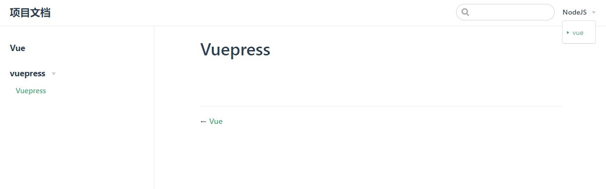

# vuepress-plugin-beautiful-bar

> 这个插件的功能是 自动生成 [vuepress](https://vuepress.vuejs.org/zh/) 的 sidebar

[Github 仓库](https://github.com/xiaminghu/vuepress-plugin-beautiful-bar)
[Gitee 仓库](https://gitee.com/xiaminghu/vuepress-plugin-beautiful-bar)
[Npm 仓库](https://www.npmjs.com/package/vuepress-plugin-beautiful-bar)

## 使用

> 假设文件结构如下

```shell
tree docs

docs
├── demo.md
├── nodejs
│   ├── README.md
│   └── vue
│       ├── README.md
│       └── vuepress
│           └── README.md
└── README.md
```

> 你只需要在 config.js 中配置好你的 themeConfig.nav，并将 beautiful-bar 添加到插件列表

```javascript
// .vuepress/config.js
module.exports = {
  themeConfig: {
    nav: [
      { text: 'demo', link: '/demo'},
      {
        text: 'contact',
        items: [
          { text: 'Github', link: 'https://github.com/xiaminghu/vuepress-plugin-beautiful-bar' }
          { text: 'Gitee', link: 'https://gitee.com/xiaminghu/vuepress-plugin-beautiful-bar' }
          { text: 'Npm', link: 'https://www.npmjs.com/package/vuepress-plugin-beautiful-bar' }
        ]
      }
      {
        text: 'NodeJS',
        items: [
          { text: 'vue', link: '/platform/vue/' },
        ]
      }
    ]
  },
  plugins: [
    'beautiful-bar'
  ]
}
```

> beautifulBar 将会为你自动生成其相对应的 sidebar

```json
{
  "/nodejs/": [
    "",
    {
      "title": "vue",
      "collapsable": true,
      "sidebarDepth": 2,
      "children": [
        "vue/",
        {
          "title": "vuepress",
          "collapsable": true,
          "sidebarDepth": 2,
          "children": ["vue/vuepress/"]
        }
      ]
    }
  ]
}
```

> 相应的 vuepress 中的效果图如下


